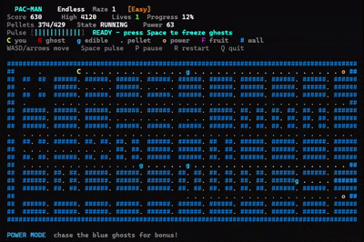

# terminal-pacman

> 外部ライブラリに依存しないC言語製の、ターミナル上で動くパックマン風ゲーム
> 
> Windows / Linux / macOS で動作



## 特徴

- **3 モード**: Classic / Endless / Time Attack
- **敵 AI**: A\* 経路探索＋4種の性格（直線追跡・待ち伏せ・挟み込み・臆病）、散開／追跡ウェーブ、終盤加速。Endless では 1 体が**オンライン Q 学習**で適応（[docs/enemy-ai.md](docs/enemy-ai.md)）。
- **新規性**: スタシス・パルス（ペレットでチャージ→敵を一時凍結）、ワープトンネル、連続捕食ボーナス、ボーナスフルーツ

## ドキュメント

- [docs/enemy-ai.md](docs/enemy-ai.md): **敵 AI の設計**（A\*探索 と Q学習）
- [SPEC.md](SPEC.md): ゲーム仕様
- [docs/MODES_DESIGN.md](docs/MODES_DESIGN.md): モード制の設計
- [CONTRIBUTING.md](CONTRIBUTING.md): 開発・貢献ガイド

## ビルド

### Windows

- MinGW-w64 GCC を使用

```powershell
powershell -ExecutionPolicy Bypass -File .\build.ps1
```

- 以下のコマンドで実行

```powershell
.\build\terminal-pacman.exe
```

### Linux / macOS

```sh
make
./build/terminal-pacman
```

## モード

- 起動メニューで **モード**と**難易度**を選択（上下でモード/難易度の行を切替、左右で値変更、`Space` で開始）

- **Classic**: 3ステージあり、最後までクリアでゲームクリア
- **Endless**: 1ミスで終了、迷路は食べ尽くすたびに自動生成され、進むほど敵が速くなる
- **Time Attack**: 制限時間 120 秒でスコアを稼ぐ

- ハイスコアはモード別に保存

## 操作方法

| キー | 操作 |
| --- | --- |
| `W` / 上矢印 | 上へ移動 |
| `A` / 左矢印 | 左へ移動 |
| `S` / 下矢印 | 下へ移動 |
| `D` / 右矢印 | 右へ移動 |
| `Space` | スタシス・パルス（チャージ満タン時に敵を凍結）／メニューで決定 |
| `P` | 一時停止 / 再開 |
| `R` | クリア / ゲームオーバー後にリスタート |
| `Q` | 終了 |

## アーキテクチャ

| モジュール | 役割 |
| --- | --- |
| `src/main.c` | エントリポイント、固定間隔ゲームループ、CLI |
| `src/game.{c,h}` | ゲーム状態と全ルール |
| `src/render.{c,h}` | 状態を読んで 1 フレームを組み立て一括描画 |
| `src/platform.{h,*}` | OS 依存を隠す平台レイヤー |
| `src/pathfind.{c,h}` | A\* 経路探索 |
| `src/qghost.{c,h}` / `src/qfeatures.{c,h}` | オンライン Q 学習コアと状態符号化 |
| `src/maze.{c,h}` | 迷路ジェネレータ（Endless / Time Attack 用） |
| `tools/` | 迷路生成・バナー生成・Q 学習のオフライン学習/評価 |

- **ゲームルールは描画・端末から独立**（`game.c`）
- **OS 依存は `platform.h` の裏に閉じ込め**、クロスプラットフォーム性を保つ
- 敵 AI のアルゴリズムは [docs/enemy-ai.md](docs/enemy-ai.md) を参照

## ライセンス

[LICENSE](LICENSE) を参照
